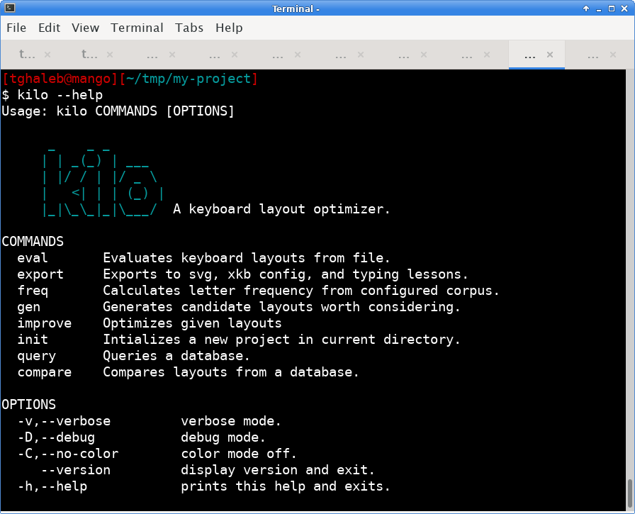

# kilo

A tool to generate, analyze, and compare keyboard layouts.

## Documentation

<https://www.tghaleb.eu.org/kilo>

## Contributors

- [Tarek Ghaleb](https://github.com/tghaleb) - creator and maintainer
