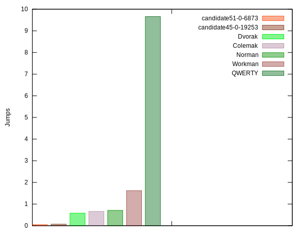

# Kilo

A tool to generate, analyze, and compare keyboard layouts.

## About

Those who spend a lot of time typing are prone to hand fatigue and
injuries. One of the top reasons for hand injuries has to do
with the keyboard layout that most of us use. QWERTY is not optimized to
minimize hand fatigue but since it is so prevalent we rarely consider
other options. There is a considerable time and effort investment in switching
to a new layout, but even when we decide to do so, we need a way to compare
existing layouts. `kilo` is a tool to help you decide which layouts are better
and more suited to your style and preferences. Not just that, but you can 
create your own custom layout that caters to your needs. There are a lot
of different views on what makes a good layout, this tool, like other
tools, takes sides and follows a certain philosophy. But you can
customize it in many ways using configuration files in addition to user
SQL statements and scoring scripts. Still, before you embark on
designing your own layout, or selecting one from what is available. You
should decide on which factors are more important in a layout
and the weights to assign these factors. 

Here is a digram showing how poor the QWERTY layout is with respect to one
factor, row jumps:



Take a look at [Philosophy](philosophy.md).

## Features

- Evaluates keyboard layouts.
- Generates keyboard layouts.
- Can generate layouts faster if fast filter is generated.
- Optimizes keyboard layouts.
- User can use custom `sql` to query layout data
- User can customize internal scoring function using a config file.
- User can use their own corpus (plain text or compressed `gz`/`zstd`).
- Generates `svg` diagrams of keyboard layouts.
- Generates `xkb` config for keyboard layouts.
- Generates typing lessons short/long.
- Generates charts for visual comparison between layouts.

## Installation

Get from <https://github.com/tghaleb/kilo>.

To build you need to have [crystal](https://crystal-lang.org/) installed on your system. In addition to 
`sqlite` and `zstd`.

```console
make release
```

copy `bin/kilo` anywhere on you path and use it from there. `kilo` has
been developed and tested on `Linux`.

## Quick Start

You will find a bundled fast filter for liep for a delta up to 0.1 and
an alternation minimum up to 0.67. You can use this directly if you want
to save some time.

data/bigrams.eng_web_2014_1M-sentences.txt.yml.zst

Also bigrams config for lip you can import directly.

```console
kilo init my-project
cd my-project
```

Edit `config/config.yaml` and set path of corpus to use.

```console
kilo freq -f data/bigrams.eng_web_2014_1M-sentences.txt.yml.zst
kilo gen -f data/fast.eng_web_2014_1M-sentences.txt.yml
kilo gen --best 10 > top.txt
kilo improve --layouts top.txt --out top.db --limit 5 sql/improve_*
kilo query top.db --sql sql/by_hand.sql --limit 100 | less
kilo query top.db --sql sql/by_hand.sql --limit 100 --layouts | head -n 3 > candidates.txt
kilo export --create-templates candidates.txt
kilo export --xkb --image --type maps/*.yaml
```

## Usage and Workflow

First you initialize a project with

```console
kilo init my-project
cd my-project
```

This will create the directory `my-project` with default directory
structure and copy config files to it.

Download a corpus to use. <https://wortschatz.uni-leipzig.de/en/download/> 
has some good ones, or get one from somewhere else. After downloading it
you will want to clean it. Edit `config/config.yaml`
for your project and set the path to your corpus.

To perform frequency analysis on your corpus,

```console
kilo freq
kilo freq -a
```

It should create `.kilo/corpus.messagpack`. The `-a` option will 
print the frequency data for you to inspect.

You can also, skip downloading a corpus and import the frequency data
from a bigrams file like the one provided in your `data/` directory.


```console
kilo freq -f path-to-bigrams-file
```

Now you're ready to do some work, Assuming you want to create your own
layout using default settings


```console
kilo gen
```

This will take some time to generate the 600+ mil combinations of left
and right characters. Here we are only looking for the best alternation
and therefore are not trying to order the keys on each side, just to
weed out unbalanced layouts, `balance_deta:` key in `config.yaml` and to
select layouts between `alternation_min:` and `alternation_max:`. To
speed it up look at the tip about working on a fast disk. Once
done, you can export fast filter data,

```console
kilo gen -e > fast_filter.yaml
```

Now if you decided to generate this data again with the same settings
for any reason, you can run

```console
kilo gen --fast path-to-fast-filter
```

and it will be somewhat faster.

To get the generated layouts,

```console
kilo gen --best 100 > top100.txt 
```

the best 100 layouts in terms of alternation, but they are
not optimized in any other way so you need to improve them,

```console
kilo improve --layouts top100.txt --out \
top100.db --limit 5 sql/improve-*
```

This will improve the left and right side of the layout. It does this
by placing the characters according to the least positional effort and then
trying all permutations that yield the same effort score in addition to
some smart brute-forcing. This is a slow
process and mostly done in memory. Best layouts from left/right databases 
are combined into the final layouts. The `limit` is used
with each SQL select.

```console
kilo query top100.db --limit 50 --sql sql/by-score.sql | less
```

You can then query selecting the ones you like. By score or other
criteria. Note that score is only to give an indication so you will
either want to tweak the scoring weights/config or base your selections
on your sql statements. Also, note that `config.yaml` has an
`improve_config` with values that effect how improve behaves so try
different combinations there to get what the results you want.


```console
kilo query top100.db --limit 10 --sql sql/by-hand.sql --layouts >
top100-hand.txt
```

and compare them together,

```console
kilo eval top100-hand.txt --out top100-hand.db --score
scripts/score.rb
kilo compare top100-hand.db
```

To export SVG, xkb config and typing lessons

```console
kilo export -T top100-outwards.txt
kilo export -tmix maps/*.yaml
```

## Tips

### Fast disk

When doing operations with heavy disk usage, database writes, etc. You
will probably want to be working on a fast disk. For example, on `Linux`
you can work on a memory disk, and then copy the data back afterwards.

### Scoring

By default `kilo` comes with a built in scorer that you can configure
by edition `data/default_scorer.yaml`. If you make changes in the configuration
and want to score again, use `query` with `--score` option and it will
update the scores.

### SQL

The provided SQL files are only examples of what you can do. You will
probably need to change them at one point, or add your own custom ones.

### Improving layouts

We only do optimization for 32 keys, the reason for this is optimizing
beyond this will have very little effect, if any, on the final
results. The frequency ratio of the 1st to the 32nd character is about 51:1. Also,
we use bitmaps that are 32bits long to do some operations. But after
you come up with the best 32 key layout, you can edit the yaml
template for the layout and add the rest of the characters manually.

When improving weights matter but not too much. The way optimization works is 
to calculate permutations for each group of keys of the same weight first to come-up with
a reasonable base-line layout. The do some brute forcing trying to find
good stats for layouts. All work is done in memory, so it will use a
considerable amount of memory.

When improving a limit of 5 is usually enough. 

```console
kilo improve --layouts best.txt --limit 5 sql/improve* -o improved.db
```

Improvement is a slow process and is configured by `improve_config` key
in your `config.yaml` file.

### Alternation

Alternation is important. Layouts with higher alternation seem to
outperform others. You can experiment with this but the top 100
alternation scores are usually the best candidates for improvements.

## Corpi

Instead of using a corpus you can import a bigram yaml file that is
already available. See the `data/` directory for using one of the
provided ones.

## Fast generation

It is a good idea to do 

```console
kilo gen --export-fast > fast.yml
```

and save that `fast.yml` file with your project in case you want to
generate again with the same settings and using the same corpus. A
fast.yml is provided in your data directory or you decide to use 
default settings.

### Various

- Characters in config need to be 32 characters long

- You might sometimes get too many open files error on `Linux`, try

```console
ulimit -n 97816
```

You can also edit `/etc/security/limits.conf` and add

```
* hard nofile 97816
* soft nofile 97816
```

## Resources

- <https://wortschatz.uni-leipzig.de/en/download/> 
- <https://en.wikipedia.org/wiki/Keyboard_layout>
- <https://en.wikipedia.org/wiki/Arabic_keyboard>

