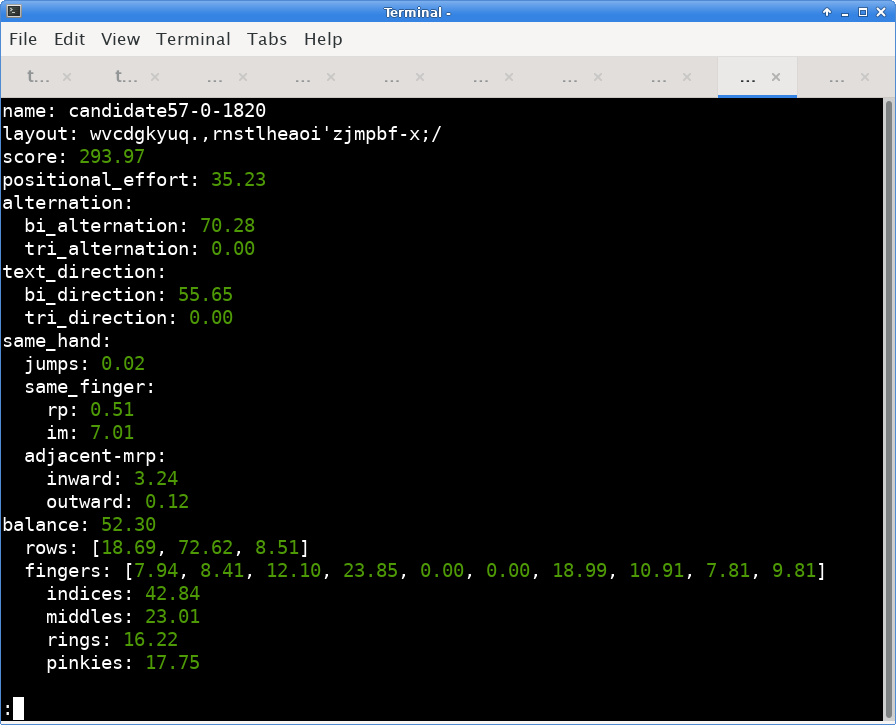
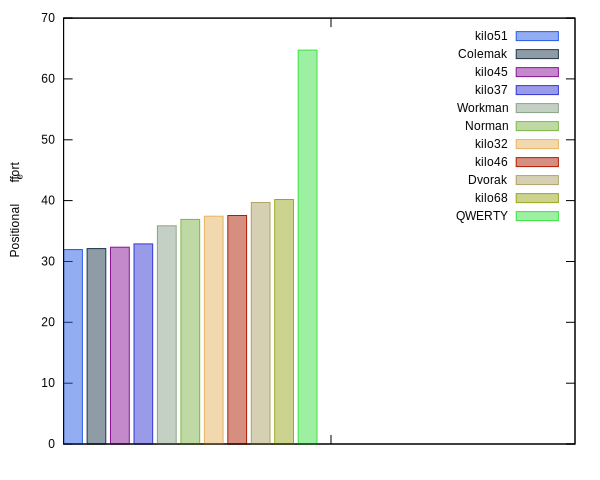
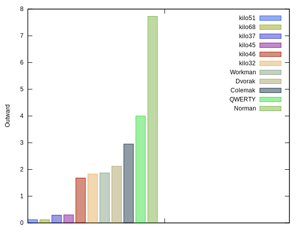
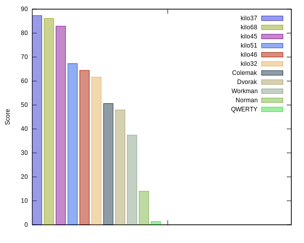

# Philosophy

There are a lot of properties to consider for layouts, and
design of a layout is subjective in many ways. There is no *best*
layout. Still, there are layouts that are better than others. There are
also bad layouts. The QWERTY layout fails on most
comparison criteria. To start with, we can define the properties of a
layout that are least subjective.

## Positional effort

The letters that are used most frequently, need to be
placed on the easiest keys to type. We use weights for effort
of each key. In `kilo` you can customize these weights but the defaults
for kilo look something like this:

As for placements of the keys, here is a heat map for QWERTY, 

and another for Dvorak,

You can clearly see that Dvoark has better placement of the keys.  `kilo` 
calculates scores for positional effort, better layouts should have less effort scores.

## Alternation

Some might argue that high alternation is not necessarily a good
thing and that typing with one hand is as fast, if not faster. Still
distributing the work on both hands must be better.  I've experimented with 
lower alternation and the important scores that
matter seem to be proportional to alternation scores. The top 100
alternation layouts seem to outperform others in all respects.

## Same Hand

What is left after alternation, which when you go for high alternation
is about 70%, is same hand effort,  Here a few factors need to be considered.

### Row Jumps

Jumps from top to bottom row or from bottom to top
should be minimized since they break the flow of typing and force you to
move your hands from their home position. So you want a small percentage
of the your total effort to be row jumps.

### Adjacent finger movement

Some adjacent finger movements are more difficult than others. The
difficulty increases when it involves the weaker outer fingers of the hand. The
index finger in general is strong enough. Adjacent index with the middle finger
is not a worry, but for the rest of the fingers it matters. There are two types of adjacent
movements. Inward and outward, outward being the one that is more difficult
for most people so we would like to minimize that.

### Same finger

Same finger for multiple keys also needs to be minimized but again we
can break it into two parts, the Index and middle fingers are not a
problem here so we should mostly minimize for pinky and ring fingers.

One thing that you will notice is that as you try to minimize one 
factor the others might go up. So you need to make a decision
which factors matter most. The defaults for `kilo` favor minimizing 
outward and jumps to same finger at the same time minimizing
the sum of these 3 factors as a whole.

### Other factors

There are other factors to consider:

- Less works for pinkies and ring fingers.
- Try to layout the letters in the same direction of the language, so T
  H is better than H T, etc.
- Programmer layouts: I think this should be done manually by placing
  the characters you need outside the 32 main characters. Programmers
  still have to write documentation and other texts so they can build on
  a layout with the main 32 characters and customize the rest. 

## The `kilo` approach

By default kilo calculates statistics for each layouts but does not
assign a score. There is a `scripts/score.rb` that can be used to assign
scores to layouts. You can customize this script or create your own. Any 
scoring system will depend on your preferences and will be biased is some way.
Sometimes, you might decide to select a layout that is not the highest scoring,
but one that has good characteristics that you would like to see in a layout.

